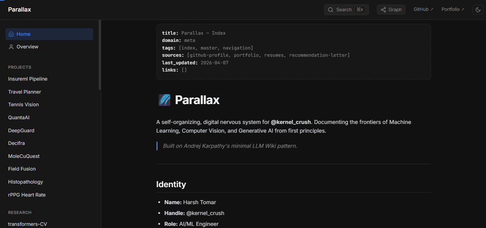
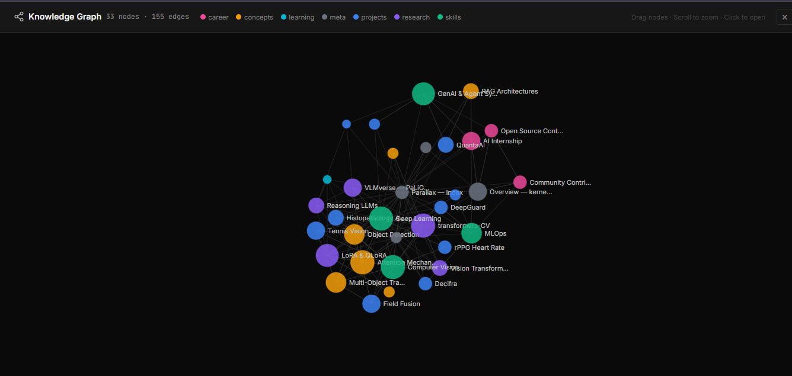
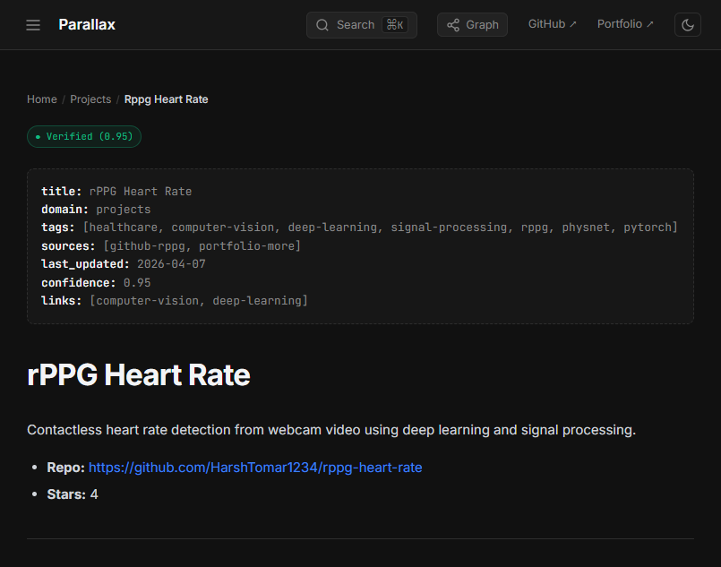
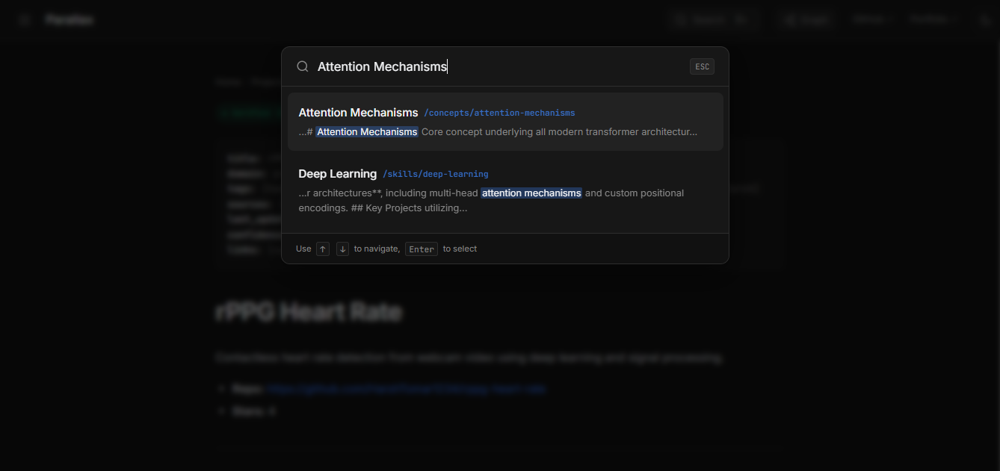
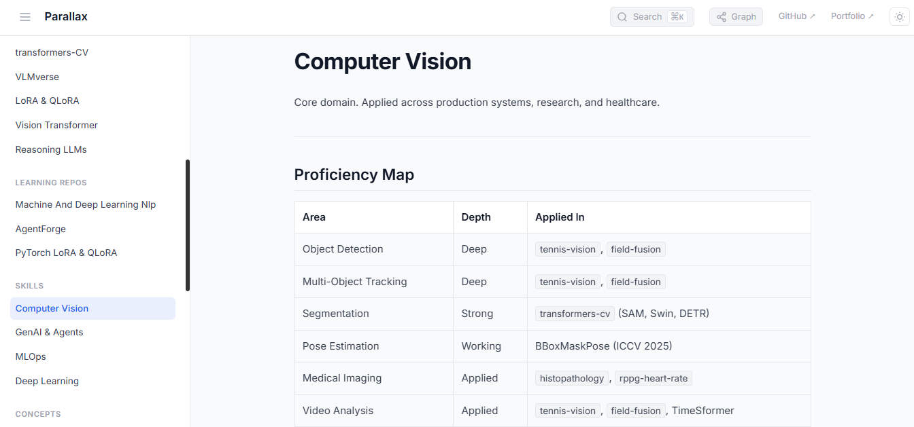
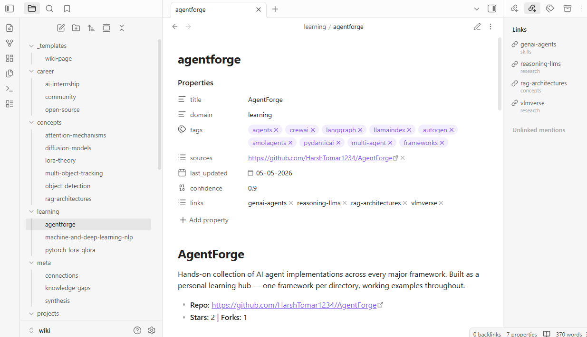
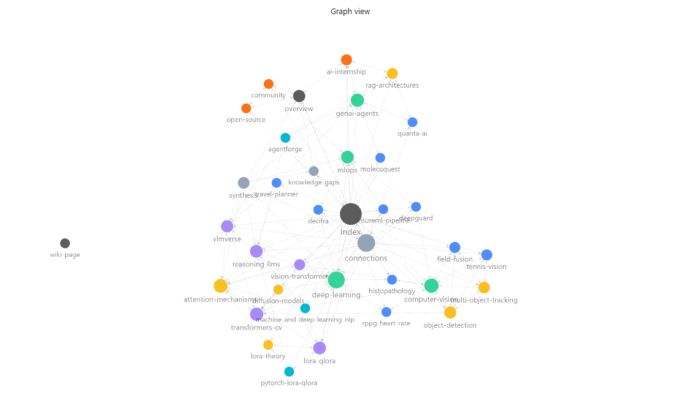

<p align="center">
  <h1 align="center">🌌 Parallax</h1>
  <p align="center">
    <strong>A self-organizing, LLM-assisted knowledge base for Machine Learning, Computer Vision, and Generative AI.</strong>
  </p>
  <p align="center">
    <em>Inspired by <a href="https://github.com/karpathy">Andrej Karpathy's</a> minimal LLM Wiki pattern.</em>
  </p>
  <p align="center">
    <a href="https://github.com/HarshTomar1234/parallax"></a>
    <a href="https://github.com/HarshTomar1234/parallax/commits/main"></a>
    <a href="wiki/index.md"></a>
    <a href="AGENTS.md"></a>
    <a href="https://harshtomar1234.github.io/parallax/"></a>
  </p>
  <p align="center">
    <strong><a href="https://harshtomar1234.github.io/parallax/">harshtomar1234.github.io/parallax</a></strong>
  </p>
</p>

---

## What is Parallax?

Parallax is not a portfolio. It is a persistent, compounding knowledge system — a living architectural map maintained by LLM-assisted agentic workflows. Every page is interlinked, every concept cross-referenced, and the entire graph is designed to be navigated by both humans and AI.

Built for: [Harsh Tomar (@kernel_crush)](https://github.com/HarshTomar1234) — AI/ML Engineer

---

## Screenshots

<p align="center">
  
  <br><br>
  <em>Home — dark-mode wiki interface with categorized sidebar navigation and Ctrl+K search</em>
</p>

<br>

<p align="center">
  
  <br><br>
  <em>Knowledge Graph — D3.js force-directed graph, 33 nodes and 155 edges, color-coded by domain</em>
</p>

<br>

<p align="center">
  
  <br><br>
  <em>Article view — breadcrumb navigation, confidence badge, collapsible sidebar</em>
</p>

<br>

<p align="center">
  
  <br><br>
  <em>Ctrl+K command palette — full-text search with keyword highlighting</em>
</p>

<br>

<p align="center">
  
  <br><br>
  <em>Light mode — system-aware theme with manual toggle</em>
</p>

<br>

<p align="center">
  
  <br><br>
  <em>Obsidian — reading view with structured Properties panel and backlinks</em>
</p>

<br>

<p align="center">
  
  <br><br>
  <em>Obsidian — graph view mirroring the SPA knowledge graph, color-coded by domain</em>
</p>

---

## Features

| Feature | Description |
|---------|-------------|
| **37 Interlinked Wiki Pages** | Projects, research implementations, skills, concepts, learning repos, and career history — fully cross-referenced with zero orphan pages |
| **D3.js Knowledge Graph** | Force-directed graph with 33 nodes and 155 edges, color-coded by domain, with drag, zoom, and click-to-navigate |
| **Ctrl+K Command Palette** | Full-text search across the entire knowledge base via a pre-built search index, with keyword highlighting and tag filtering |
| **Confidence Scoring** | Every page carries a confidence score (0.0–1.0); rendered as a color-coded badge — Verified, High, Medium, or Low |
| **Dark / Light Mode** | System-aware theme with manual toggle; state persisted across sessions |
| **Collapsible Sidebar** | Desktop sidebar collapses to full-width reading mode with smooth animation; state persisted via localStorage |
| **Breadcrumb Navigation** | Hierarchical path shown on every page (Home / Domain / Page) |
| **Reading Progress Bar** | Thin progress indicator at the top of the viewport as you scroll long articles |
| **Obsidian Vault Integration** | The `wiki/` directory opens directly as an Obsidian vault — full graph view, backlinks panel, and Properties rendering with no configuration required |
| **LLM-Assisted Workflows** | Structured schema for ingesting new repos, generating pages, and validating the knowledge graph via CI |

---

## Repository Structure

```
parallax/
├── wiki/                    # Core knowledge graph (37 pages)
│   ├── index.md             # Master entry point
│   ├── overview.md          # High-level identity and stats
│   ├── log.md               # Append-only activity log
│   ├── projects/            # 10 production system pages
│   ├── research/            # From-scratch implementations (5 pages)
│   ├── skills/              # Skill domain pages (CV, GenAI, MLOps, DL)
│   ├── concepts/            # Deep-dive concept pages (6 pages)
│   ├── career/              # Career timeline and contributions
│   ├── learning/            # Learning repository pages (3 pages)
│   ├── meta/                # Synthesis, connections, knowledge gaps
│   └── _templates/          # Page template for Obsidian
├── landing/                 # Static web interface
│   ├── index.html           # SPA shell with sidebar, topbar, graph overlay
│   ├── style.css            # Obsidian-inspired dark/light theme
│   └── script.js            # Markdown renderer, D3 graph, command palette
├── raw/                     # Immutable source material
│   └── resumes/             # Domain-specific PDF resumes
├── _agents/
│   ├── scripts/             # validate_wiki.py, check_orphans.py, generate_exports.py
│   └── workflows/           # Agent workflow definitions
├── .github/workflows/       # CI/CD: deploy, validation, weekly ingest
├── images/                  # README screenshots
├── AGENTS.md                # Agent schema and conventions
└── README.md
```

---

## Knowledge Graph

### Projects (Production Systems)
`insureml-pipeline` · `travel-planner` · `tennis-vision` · `quanta-ai` · `deepguard` · `decifra` · `molecuquest` · `field-fusion` · `histopathology` · `rppg-heart-rate`

### Research (From-Scratch Implementations)
`transformers-cv` (11 architectures) · `vlmverse` (PaLiGemma) · `lora-qlora` · `reasoning-llms` · `vision-transformer`

### Skills
`computer-vision` · `genai-agents` · `mlops` · `deep-learning`

### Concepts
`attention-mechanisms` · `diffusion-models` · `rag-architectures` · `lora-theory` · `object-detection` · `multi-object-tracking`

### Learning Repos
`machine-and-deep-learning-nlp` · `agentforge` · `pytorch-lora-qlora`

### Meta
`synthesis` · `connections` · `knowledge-gaps`

---

## Agentic Workflows

The repository uses an LLM-assisted workflow system defined in [`AGENTS.md`](AGENTS.md). Rather than fully autonomous black-box agents, this repository uses explicit prompts and scripts to assist the human creator in:

- **Ingestion** — Reading new sources (GitHub repos, papers) to generate structured wiki pages
- **Querying** — Synthesizing answers from the knowledge graph
- **Linting** — Detecting orphan pages, missing cross-references, and stale metrics via CI

Trigger ingestion remotely via the **LLM Auto-Ingest** GitHub Action (`workflow_dispatch`). Provide a repository URL and it will fetch the source, generate a structured wiki page, and open a pull request.

CI also auto-generates AI-consumable exports on every push: `llms.txt`, `llms-full.txt`, `graph.json`, and `search-index.json`.

---

## Quick Start

```bash
# Clone the repository
git clone https://github.com/HarshTomar1234/parallax.git
cd parallax

# Serve locally
python -m http.server 8000

# Open in browser
# http://localhost:8000/landing/
```

To edit in Obsidian: open the `wiki/` folder as a vault. The directory is pre-configured with graph colors, a page template, and proper `.gitignore` exclusions.

Or start reading directly: **[wiki/index.md](wiki/index.md)**

---

## Tech Stack

- **Frontend:** Vanilla HTML/CSS/JS — Inter and JetBrains Mono fonts
- **Rendering:** marked.js (client-side markdown to HTML)
- **Graph:** D3.js v7 — force-directed simulation with drag, zoom, and domain color groups
- **Search:** Pre-built `search-index.json` loaded at startup; full-text with keyword highlighting
- **Local Editor:** Obsidian — vault opens directly from `wiki/` with graph and backlinks
- **Hosting:** Static files auto-deployed to GitHub Pages via CI/CD

> The lightweight Vanilla HTML/JS stack with client-side rendering is a deliberate architectural decision. It prioritizes extreme simplicity, zero dependencies, and decades-long resilience over framework complexity.

---

<p align="center">
  Built by <a href="https://github.com/HarshTomar1234">@kernel_crush</a>
  <br>
  <a href="https://harshtomar1234.github.io/parallax/">Live Wiki</a> · <a href="https://kernel-crush.netlify.app">Portfolio</a> · <a href="https://www.linkedin.com/in/harsh-tomar-a96a38256/">LinkedIn</a> · <a href="https://x.com/kernel_crush">X</a>
</p>
